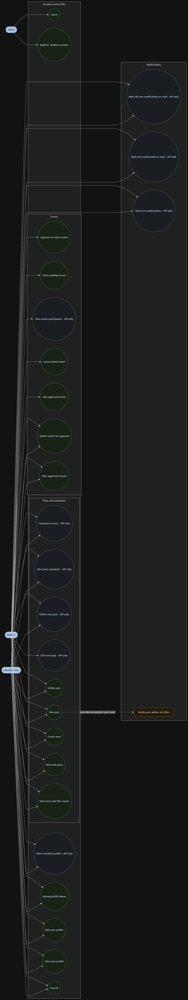
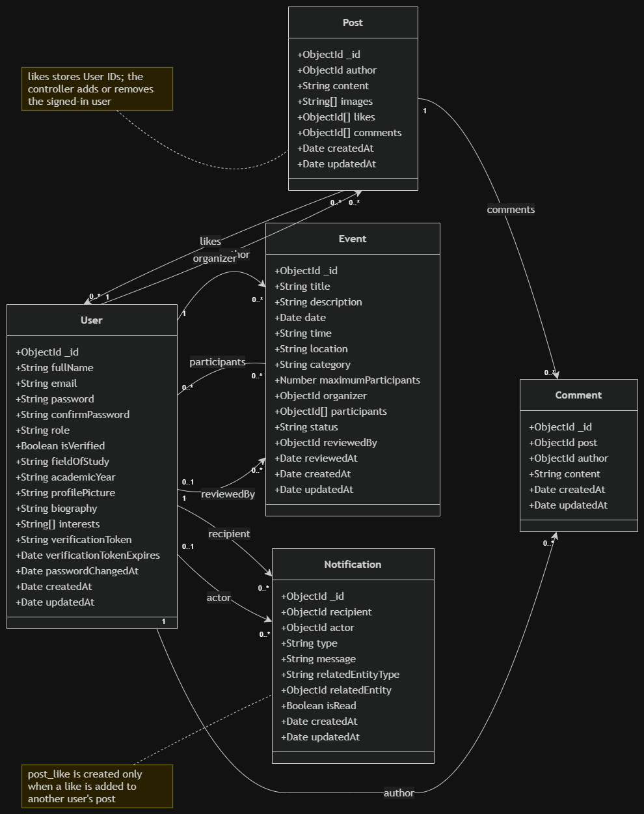

# EnaaConnect

### A centralized digital community for ENAA students

Connect, collaborate, organize events, share knowledge, and stay informed through one student-focused platform.

[Software Requirements Specification](./EnaaConnect_SRS.pdf) ·
[Use Case Diagram](./docs/diagrams/use_case.png) ·
[Class Diagram](./docs/diagrams/class_daigram.png)

</div>

---

> EnaaConnect is under active development. The SRS defines the target product; the implementation status below describes what currently exists in this repository.

## Documentation

- [Software Requirements Specification (PDF)](./docs/Software%20Requirements%20fill%20rouge%20project.pdf)
- [Planned use case diagram (PlantUML)](./docs/diagrams/planned-use-case-diagram.puml)
- [Use case diagram source](./docs/diagrams/use-case-diagram.mmd)
- [Class diagram source](./docs/diagrams/class-diagram.mmd)

<details>
<summary>View the use case diagram</summary>



</details>

<details>
<summary>View the class diagram</summary>



</details>

The use case diagram distinguishes frontend-connected flows from API-only capabilities. The class diagram shows the five current Mongoose models: User, Post, Comment, Event, and Notification.

## Purpose and scope

EnaaConnect provides one authenticated space for campus posts, profiles, events, and activity notifications. Students can participate in the community, while administrators review submitted events before publication.

The current SRS covers:

- Registration, login, current-user access, logout, and password reset by email
- Profile editing, profile pictures, public profiles, and authored posts
- Posts with text or one optional image, likes, and comments
- Event submission, administrator review, approved-event discovery, and participation
- Notifications for selected post and event actions

Clubs, private messaging, search, bookmarks, and a separate trip-planning module are outside the scope of the current SRS. `trips` remains an event category.

## Users and roles

| Actor | Access |
|---|---|
| Visitor | Register as a student and log in |
| Student | Use protected content, manage their profile, create posts and events, and join or leave approved events |
| Administrator | Use protected content and review pending events |

Registration creates a `student` account. The backend role enum contains `student` and `admin`; it does not provide public administrator registration.

The server enforces authentication, roles, and ownership. Hiding a control in the frontend does not replace a server permission check.

## Implementation status

| Area | Backend | Frontend |
|---|---|---|
| Registration, login, current user, and logout | Implemented | Connected |
| Password reset by email | Required by SRS; not implemented | No connected flow |
| Own profile editing and picture upload | Implemented | Connected |
| Public profile by user ID | Implemented | No dedicated screen |
| Feed, post creation, and likes | Implemented | Connected |
| Post editing and deletion | Implemented | No connected controls |
| Post comments | Implemented | No connected comment flow |
| Approved events, submission, join, and leave | Implemented | Connected |
| Administrator event review | Implemented | Connected |
| Event participant list | Implemented | No connected screen |
| Notifications and authenticated Socket.IO delivery | Implemented on server | No connected notification interface |

The diagrams show the current implementation. They do not mean every API capability has a frontend screen.

## Technology stack

| Layer | Technologies |
|---|---|
| Frontend | React, JavaScript, Vite, React Router, Tailwind CSS, Axios, Lucide React |
| Backend | Node.js ES modules, Express, Zod |
| Database | MongoDB, Mongoose |
| Authentication | JWT Bearer tokens, bcryptjs |
| Images | Multer, Cloudinary |
| Real-time events | Socket.IO |
| Local backend deployment | Docker Compose with MongoDB |

The SRS specifies Nodemailer for password-reset email, but password-reset routes and email delivery are not implemented in the current backend.

## Project structure

```text
EnaaConnect/
├── .github/workflows/       # Current CI workflows
├── client/                  # React and Vite frontend
├── server/                  # Express API and auth tests
├── docs/
│   ├── Software Requirements fill rouge project.pdf
│   └── diagrams/
│       ├── use-case-diagram.mmd
│       ├── use-case-diagram.drawio.png
│       ├── class-diagram.mmd
│       └── class-diagram.drawio.png
├── docker-compose.yml
└── README.md
```

The local `ui-reference` directory guides frontend appearance and is excluded from Git.

## API overview

All protected routes require:

```http
Authorization: Bearer <JWT>
```

### Authentication

| Method | Endpoint | Access | Purpose |
|---|---|---|---|
| `POST` | `/api/auth/register` | Public | Create a student account |
| `POST` | `/api/auth/login` | Public | Sign in |
| `GET` | `/api/auth/me` | Authenticated | Get the current user |
| `POST` | `/api/auth/logout` | Authenticated | Return a logout response |

Password-reset endpoints are required by the SRS but are not mounted in the current backend.

### Profiles

| Method | Endpoint | Purpose |
|---|---|---|
| `GET` | `/api/users/:userId` | Get a public student profile |
| `PATCH` | `/api/users/update-profile` | Update the current user's allowed profile fields |
| `PATCH` | `/api/users/profile-picture` | Upload one profile picture |

### Posts and comments

| Method | Endpoint | Purpose |
|---|---|---|
| `GET` | `/api/posts` | Get posts |
| `POST` | `/api/posts` | Create a post |
| `PATCH` | `/api/posts/:postId` | Update an owned post |
| `DELETE` | `/api/posts/:postId` | Delete an owned post |
| `PATCH` | `/api/posts/:postId/like` | Like or unlike a post |
| `GET` | `/api/posts/:postId/comments` | Get comments |
| `POST` | `/api/posts/:postId/comments` | Add a comment |

A post can contain text, one image, or both. The upload accepts JPEG, PNG, or WebP images up to 3 MB.

### Events

| Method | Endpoint | Purpose |
|---|---|---|
| `GET` | `/api/events` | Get approved events |
| `POST` | `/api/events` | Submit an event for review |
| `GET` | `/api/events/pending` | Get pending events as an administrator |
| `PATCH` | `/api/events/:eventId/review` | Approve or reject a pending event |
| `GET` | `/api/events/:eventId/participants` | Get participants of an approved event as a student |
| `POST` | `/api/events/:eventId/join` | Join an approved event as a student |
| `DELETE` | `/api/events/:eventId/join` | Leave an event as a student |

New events start as `pending`. Only approved events appear in the discoverable event list.

### Notifications

| Method | Endpoint | Purpose |
|---|---|---|
| `GET` | `/api/notifications` | Get the current user's notifications and unread count |
| `PATCH` | `/api/notifications/:notificationId/read` | Mark one owned notification as read |
| `PATCH` | `/api/notifications/read-all` | Mark all owned notifications as read |

The backend creates notifications for selected likes, comments, event joins, and event review outcomes. It can emit a `newNotification` Socket.IO event to an authenticated recipient.

## Getting started

### Prerequisites

- Node.js 22.12 or newer
- npm
- MongoDB or a MongoDB Atlas connection
- Cloudinary credentials if you want to upload images

### Install dependencies

```bash
git clone https://github.com/elhajjame/EnaaConnect.git
cd EnaaConnect

npm ci --prefix server
npm ci --prefix client
```

### Configure the backend

Create `server/.env`:

```env
PORT=3000
CLIENT_URL=http://localhost:5173
CONNECT_DB=your_mongodb_connection_string
JWT_SECRET=your_private_jwt_secret
JWT_EXPIRES_IN=7d

CLOUDINARY_CLOUD_NAME=your_cloudinary_cloud_name
CLOUDINARY_API_KEY=your_cloudinary_api_key
CLOUDINARY_API_SECRET=your_cloudinary_api_secret
```

Do not commit `.env` files or secret values.

### Run the application

Start the backend in one terminal:

```bash
cd server
npm run dev
```

Start the frontend in another terminal:

```bash
cd client
npm run dev
```

The backend defaults to `http://localhost:3000`. Vite normally serves the frontend at `http://localhost:5173` and proxies local `/api` requests to the backend.

For a separately hosted frontend, `VITE_API_URL` can point to the deployed API:

```env
VITE_API_URL=https://your-api-domain.example/api
```

Frontend `VITE_` variables are visible in the browser. Do not put secrets in them. A separate frontend origin also needs an appropriate API proxy or HTTP CORS configuration.

## Tests and CI

Run the backend auth tests:

```bash
npm test --prefix server
```

The auth suite uses Supertest and a temporary MongoDB instance. It covers the implemented registration, login, current-user, and logout routes without using the development database.

Check the frontend:

```bash
npm run lint --prefix client
npm run build --prefix client
```

GitHub Actions currently contains:

- `backend-auth.yml`, which runs the backend auth tests
- `frontend-ci.yml`, which installs frontend dependencies, runs lint, and builds the frontend

These workflows perform CI checks. They do not deploy the application.

## Current gaps

- Password reset by email is required by the SRS but has no mounted backend routes.
- Several implemented APIs still need frontend controls or screens, including comments, post editing and deletion, event participants, and notifications.
- Logout clears the browser's stored token; the backend does not revoke an already issued JWT.
- There is no refresh-token flow.
- Production frontend hosting, route rewrites, API access, and deployment automation remain to be configured.
